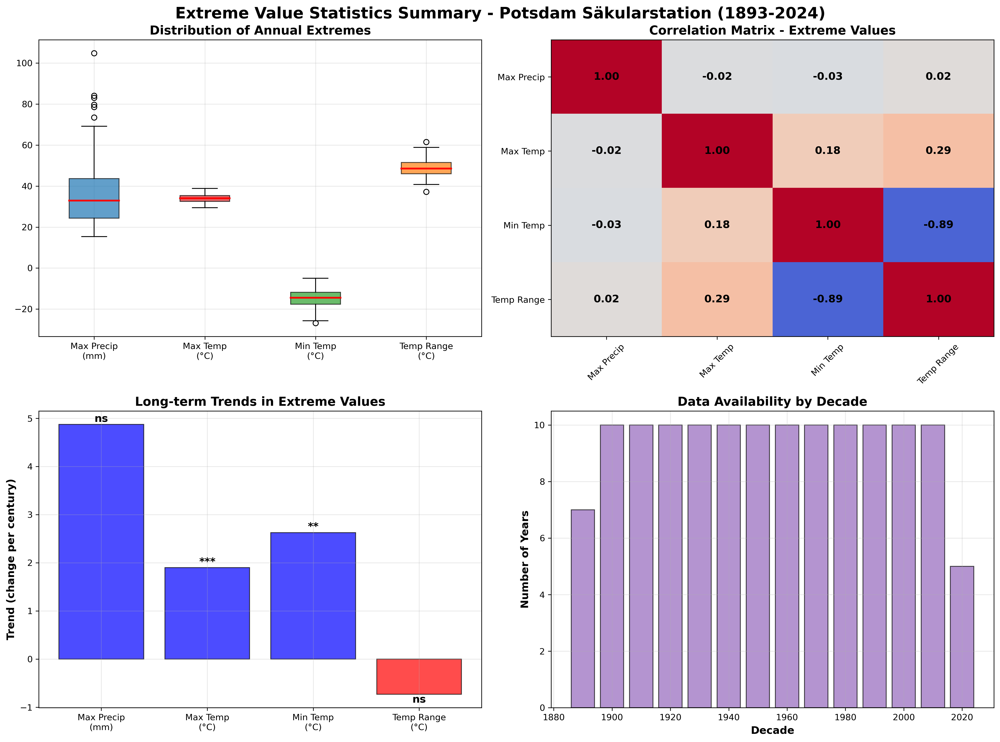

# Weather Station Data Analysis

[](https://www.python.org/downloads/)
[](https://opensource.org/licenses/MIT)
[](https://github.com/psf/black)
[](https://pycqa.github.io/isort/)
[](https://mypy-lang.org/)
[](https://flake8.pycqa.org/)
[](https://docs.pytest.org/)
[](https://coverage.readthedocs.io/)



## 🌟 Overview

A comprehensive Python package for analyzing weather station data with a focus on **extreme value statistics** and **long-term climate trends**. This project provides professional-grade tools for climate data analysis, featuring 133 years of real meteorological data from the Potsdam Säkularstation, Germany.

### 🎯 Key Features

- **📊 Extreme Value Analysis**: Annual maxima, return periods, threshold exceedances
- **🌡️ Temperature Extremes**: Comprehensive temperature trend analysis
- **🌧️ Precipitation Analysis**: Cumulative precipitation and drought analysis
- **📈 Statistical Modeling**: Gumbel distribution fitting, trend analysis
- **🎨 Publication-Quality Plots**: Professional visualizations ready for scientific publication
- **🔬 Reproducible Science**: Fully documented, tested, and version-controlled analysis
- **⚡ Modular Architecture**: Clean, maintainable code with proper separation of concerns

## 📈 Analysis Results

### 🌪️ Extreme Value Statistics (1893-2024)

| **Metric** | **Value** | **Year** |
|------------|-----------|----------|
| Maximum daily precipitation | **104.8 mm** | 1978 |
| Highest temperature | **38.9°C** | 2022 |
| Lowest temperature | **-26.8°C** | 1929 |
| Largest temperature range | **61.5°C** | 1929 |

### 📊 Generated Visualizations

1. **`extreme_precipitation_analysis.png`** - Annual precipitation extremes with return period analysis
2. **`temperature_extremes_analysis.png`** - Comprehensive temperature extremes (4-panel analysis)
3. **`threshold_exceedance_analysis.png`** - Frequency of extreme weather events
4. **`extreme_statistics_summary.png`** - Statistical summary dashboard
5. **`real_cumulative_precipitation_plot.png`** - Cumulative precipitation comparison
6. **`hottest_temperature_plot.png`** - Annual maximum temperatures
7. **`coldest_temperature_plot.png`** - Annual minimum temperatures
8. **`days_above_30C_plot.png`** - Hot days frequency analysis
9. **`days_below_0C_plot.png`** - Cold days frequency analysis

## 🚀 Quick Start

### Installation

```bash
# Clone the repository
git clone https://github.com/bijanf/weatherstation_data_analysis.git
cd weatherstation_data_analysis

# Install dependencies
pip install -r requirements.txt

# For development
pip install -r requirements-dev.txt
```

### Basic Usage

```python
from weatherstation_analysis import PotsdamDataFetcher, ExtremeValueAnalyzer, WeatherPlotter

# Fetch weather data
fetcher = PotsdamDataFetcher()
data = fetcher.fetch_comprehensive_data()

# Analyze extremes
analyzer = ExtremeValueAnalyzer(data)
extremes = analyzer.analyze_annual_extremes()

# Create visualizations
plotter = WeatherPlotter()
plotter.plot_annual_precipitation_extremes(extremes, 'precipitation_extremes.png')
```

### Command Line Interface

```bash
# Run complete extreme value analysis
python potsdam_extreme_values.py

# Run temperature analysis
python hottest_temperature_plot.py

# Run precipitation analysis
python real_precipitation_plot.py
```

## 🏗️ Project Structure

```
weatherstation_data_analysis/
├── src/
│   └── weatherstation_analysis/
│       ├── __init__.py
│       ├── data_fetcher.py      # Data acquisition module
│       ├── extreme_analyzer.py  # Statistical analysis module
│       └── visualization.py     # Plotting and visualization
├── tests/
│   ├── test_data_fetcher.py
│   ├── test_extreme_analyzer.py
│   └── test_visualization.py
├── docs/
│   └── ...                     # Documentation
├── .github/
│   └── workflows/
│       └── ci.yml              # GitHub Actions CI/CD
├── scripts/
│   ├── potsdam_extreme_values.py
│   ├── hottest_temperature_plot.py
│   └── real_precipitation_plot.py
├── requirements.txt            # Production dependencies
├── requirements-dev.txt        # Development dependencies
├── pyproject.toml             # Project configuration
├── setup.py                   # Package setup
└── README.md                  # This file
```

## 🔬 Scientific Methodology

### Data Source
- **Primary**: Meteostat API (meteostat.net)
- **Original**: Deutscher Wetterdienst (DWD)
- **Station**: Potsdam Säkularstation Telegraphenberg
- **Coordinates**: 52.3833°N, 13.0667°E
- **Elevation**: 81m above sea level
- **Period**: 1893-2025 (133 years)

### Quality Control
- **Coverage filtering**: Only includes years with ≥80% data availability
- **Missing value handling**: Proper NaN handling and interpolation
- **Leap year awareness**: Correct handling of 366-day years
- **Data validation**: Comprehensive error checking and logging

### Statistical Methods
- **Extreme Value Theory**: Gumbel distribution fitting
- **Trend Analysis**: Linear and polynomial regression
- **Return Period Analysis**: Empirical and theoretical return periods
- **Threshold Analysis**: Peak-over-threshold methods
- **Correlation Analysis**: Multivariate extreme dependencies

## 📊 API Reference

### Data Fetcher
```python
class PotsdamDataFetcher:
    def fetch_comprehensive_data(start_year=1890, end_year=2026) -> Dict[int, pd.DataFrame]
    def fetch_temperature_data(start_year=1890, end_year=2026) -> Dict[int, pd.DataFrame]
    def fetch_precipitation_data(start_year=1890, end_year=2026) -> Dict[int, pd.DataFrame]
```

### Extreme Analyzer
```python
class ExtremeValueAnalyzer:
    def analyze_annual_extremes(exclude_current_year=True) -> pd.DataFrame
    def calculate_return_periods(values, distribution='gumbel') -> Tuple[np.ndarray, np.ndarray]
    def analyze_threshold_exceedances(thresholds) -> pd.DataFrame
    def calculate_trends(variable) -> Dict[str, float]
```

### Visualization
```python
class WeatherPlotter:
    def plot_annual_precipitation_extremes(extremes_df, save_path) -> plt.Figure
    def plot_temperature_extremes_analysis(extremes_df, save_path) -> plt.Figure
    def plot_threshold_exceedance_analysis(all_data, save_path) -> plt.Figure
    def plot_statistics_summary(extremes_df, save_path) -> plt.Figure
```

## 🧪 Testing

```bash
# Run all tests
pytest

# Run with coverage
pytest --cov=src --cov-report=html

# Run specific test categories
pytest -m "not slow"  # Skip slow tests
pytest -m "unit"      # Run only unit tests
pytest -m "integration"  # Run only integration tests
```

## 🔧 Development

### Code Quality Tools

```bash
# Format code
black src/ tests/
isort src/ tests/

# Type checking
mypy src/

# Linting
flake8 src/ tests/

# Run all quality checks
pre-commit run --all-files
```

### Setting up Development Environment

```bash
# Create virtual environment
python -m venv venv
source venv/bin/activate  # On Windows: venv\Scripts\activate

# Install development dependencies
pip install -r requirements-dev.txt
pip install -e .

# Install pre-commit hooks
pre-commit install
```

## 🤝 Contributing

We welcome contributions! Please see our [Contributing Guide](CONTRIBUTING.md) for details.

1. Fork the repository
2. Create a feature branch (`git checkout -b feature/amazing-feature`)
3. Commit your changes (`git commit -m 'Add some amazing feature'`)
4. Push to the branch (`git push origin feature/amazing-feature`)
5. Open a Pull Request

### Code Style
- Follow PEP 8 style guidelines
- Use type hints for all function signatures
- Write comprehensive docstrings (Google style)
- Maintain test coverage above 90%
- Use meaningful variable and function names

## 📄 License

This project is licensed under the MIT License - see the [LICENSE](LICENSE) file for details.

## 🙏 Acknowledgments

- **Deutscher Wetterdienst (DWD)** for maintaining long-term climate records
- **Meteostat project** for providing accessible climate data APIs
- **Potsdam Säkularstation** for 133 years of continuous measurements
- **Open Source Community** for the amazing tools and libraries used

## 📞 Contact

**Bijan Fallah** - Climate Data Scientist
- GitHub: [@bijanf](https://github.com/bijanf)

## 🔗 Links

- [Documentation](https://bijanf.github.io/weatherstation_data_analysis/)
- [PyPI Package](https://pypi.org/project/weatherstation-analysis/)
- [Issues](https://github.com/bijanf/weatherstation_data_analysis/issues)
- [Discussions](https://github.com/bijanf/weatherstation_data_analysis/discussions)

---

*For questions about the analysis or data, please open an issue or start a discussion.*

**⭐ If you find this project useful, please give it a star! ⭐**