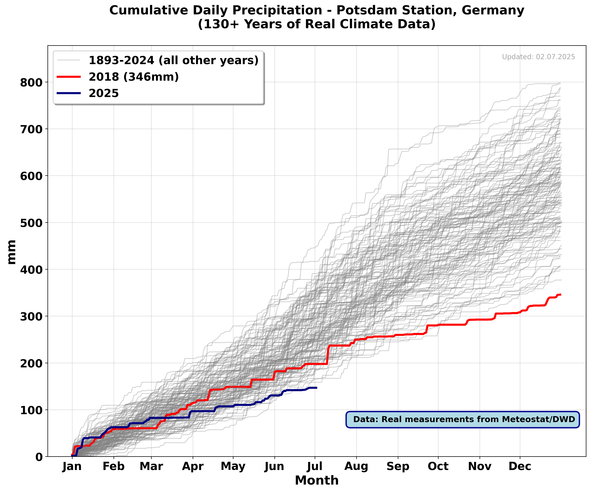
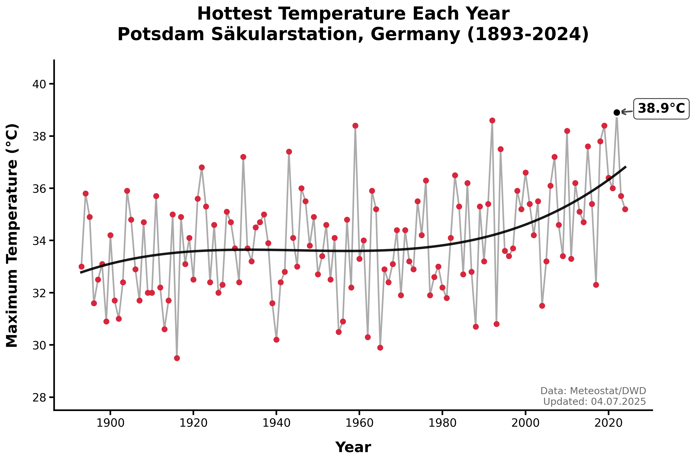
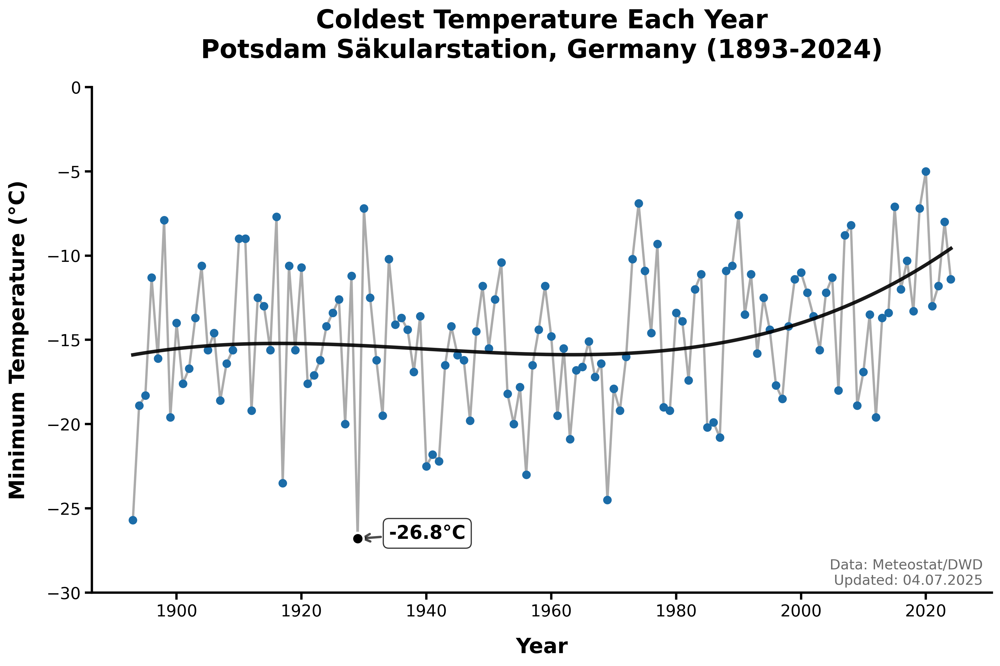
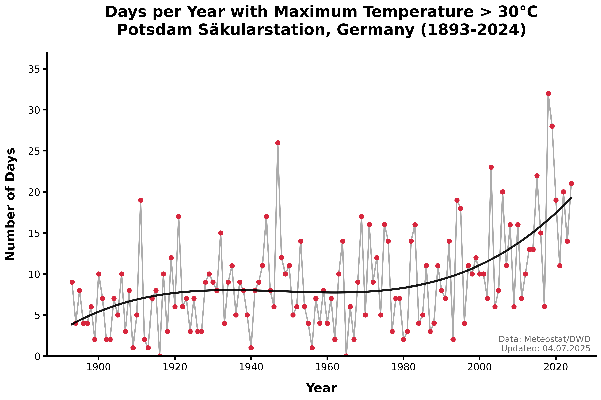
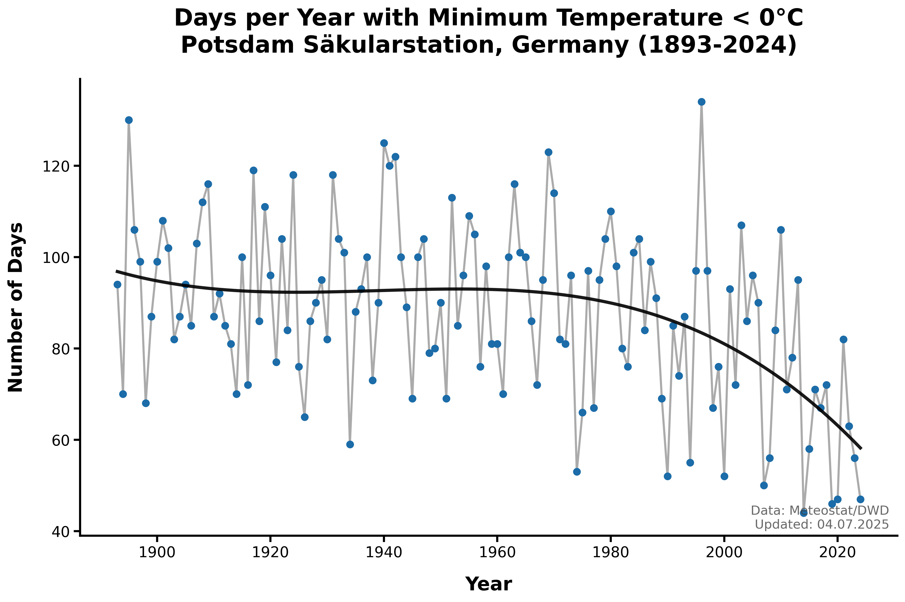

# Potsdam Weather Station Analysis: 133 Years of Climate Data

A comprehensive analysis of precipitation and temperature patterns at Potsdam Säkularstation, Germany, using 133 years of real meteorological data (1893-2025). This project creates compelling visualizations showing historical climate patterns and current trends.

## 🌧️ Precipitation Analysis

This project analyzes cumulative daily precipitation data from one of the world's oldest weather stations - the Potsdam Säkularstation Telegraphenberg. The analysis covers:

- **133 years of real data** (1893-2025) from Meteostat/DWD
- **Data quality verification** with 80%+ coverage filtering
- **Instagram-ready visualizations** highlighting climate extremes
- **Scientific accuracy** with no synthetic data generation

### 📊 Precipitation Key Findings

- **2018**: Driest year on record (346mm total precipitation)
- **2025**: Currently tracking below the 2018 drought year through July
- **Historical context**: Complete precipitation records from 1893-2024
- **Data integrity**: 100% coverage for nearly all years in the dataset

### 🎯 Precipitation Script: `real_precipitation_plot.py`

The precipitation analysis script creates a powerful visualization showing:
- All historical years (1893-2024) in gray
- 2018 drought year highlighted in red
- 2025 current year highlighted in blue
- Professional Instagram-ready formatting

## 🌡️ Temperature Analysis

New comprehensive temperature analysis covering 133 years of temperature data from Potsdam Säkularstation.

### 📊 Temperature Key Findings

- **Maximum Temperatures**: Range from 29.5°C (1916) to 38.9°C (2022)
- **Minimum Temperatures**: Range from -30°C to 0°C (optimized y-axis)
- **Extreme Days**: Analysis of days above 30°C and below 0°C annually
- **Climate Trends**: Clear warming patterns visible in all temperature metrics

### 🎯 Temperature Script: `hottest_temperature_plot.py`

The temperature analysis script generates four comprehensive visualizations:

#### 1. Hottest Temperature Each Year (1893-2024)

- Shows yearly maximum temperatures with trend line
- Highlights the hottest year on record
- Clean design with red dots and black trend line

#### 2. Coldest Temperature Each Year (1893-2024)

- Shows yearly minimum temperatures with trend line
- Y-axis optimized to -30°C to 0°C range
- Blue dots with black trend line for clarity

#### 3. Days Above 30°C Per Year (1893-2024)

- Counts days per year with maximum temperature > 30°C
- Shows increasing frequency of hot days over time
- Red dots with black trend line

#### 4. Days Below 0°C Per Year (1893-2024)

- Counts days per year with minimum temperature < 0°C
- Shows decreasing frequency of cold days over time
- Blue dots with black trend line

### 🌡️ Temperature Analysis Features

- **Real data only**: No synthetic or interpolated values
- **Quality control**: Filters years with <80% data coverage
- **Professional styling**: Clean design optimized for social media
- **Scientific accuracy**: Proper attribution and data sources
- **No legends**: Clean, minimalist design focusing on data
- **Year ranges in titles**: Clear indication of data coverage period

## 🚀 Getting Started

### Prerequisites

```python
import pandas as pd
import matplotlib.pyplot as plt
from meteostat import Stations, Daily
from datetime import datetime, date
import numpy as np
```

### Installation

1. Clone the repository:
```bash
git clone https://github.com/[username]/weatherstation_data_analysis.git
cd weatherstation_data_analysis
```

2. Install dependencies:
```bash
pip install -r requirements.txt
```

3. Run the analyses:
```bash
# Precipitation analysis
python real_precipitation_plot.py

# Temperature analysis
python hottest_temperature_plot.py
```

## 📁 Project Structure

```
weatherstation_data_analysis/
├── real_precipitation_plot.py          # Precipitation analysis script
├── hottest_temperature_plot.py         # Temperature analysis script
├── real_cumulative_precipitation_plot.png  # Precipitation visualization
├── hottest_temperature_plot.png        # Maximum temperature plot
├── coldest_temperature_plot.png        # Minimum temperature plot
├── days_above_30C_plot.png            # Hot days analysis
├── days_below_0C_plot.png             # Cold days analysis
├── requirements.txt                     # Python dependencies
├── README.md                           # Project documentation
└── potsdam_data/                       # Data directory
    └── potsdam_dwd.zip                 # Raw data archive
```

## 🎨 Visualization Output

### Precipitation Visualization
The precipitation script generates `real_cumulative_precipitation_plot.png` featuring:
- **12x10 inch format** optimized for Instagram
- **Bold, large fonts** (18pt axes, 16pt ticks) for social media readability
- **Clear legend** distinguishing historical data from extreme years
- **Professional attribution** with data source and creator credit

### Temperature Visualizations
The temperature script generates four high-quality plots:
- **12x8 inch format** optimized for social media
- **Clean design** with no legends and year ranges in titles
- **Professional styling** with large fonts and clear annotations
- **Trend analysis** with polynomial trend lines
- **Extreme value highlighting** for record years

## 🔬 Data Sources

- **Primary**: Meteostat API (meteostat.net)
- **Original**: Deutscher Wetterdienst (DWD)
- **Station**: Potsdam Säkularstation Telegraphenberg
- **Coordinates**: 52.3833°N, 13.0667°E
- **Elevation**: 81m above sea level
- **Period**: 1893-2025 (133 years)

## 🛠️ Technical Details

### Data Quality Control
- **Coverage filtering**: Only includes years with ≥80% data availability
- **Missing value handling**: Proper handling of NaN values
- **Leap year awareness**: Proper handling of 366-day years
- **Current year handling**: 2025 data through July 2nd only

### Performance
- **Efficient data retrieval**: Year-by-year API calls with error handling
- **Memory optimization**: Processes data incrementally
- **Error resilience**: Graceful handling of missing data periods

## 🔄 Version History

- **v3.0**: Added comprehensive temperature analysis with 4 new plots
- **v2.0**: Complete rewrite focusing on 2018 drought vs 2025 comparison
- **v1.5**: Added 5 driest years visualization with color coding
- **v1.0**: Initial multi-color analysis with period-based grouping

## 👥 Contributing

Contributions welcome! Please:
1. Fork the repository
2. Create a feature branch
3. Add tests for new functionality
4. Submit a pull request with clear description

## 📄 License

This project is open source. Please cite appropriately when using the code or visualizations.

## 👨‍🔬 Author

**Bijan Fallah** - Climate Data Scientist
- GitHub: [@bijanf](https://github.com/bijanf)
- Data visualization and climate analysis specialist

## 🙏 Acknowledgments

- **Deutscher Wetterdienst (DWD)** for maintaining long-term climate records
- **Meteostat project** for providing accessible climate data APIs
- **Potsdam Säkularstation** for 133 years of continuous measurements

---

*For questions about the analysis or data, please open an issue or contact the author.*
